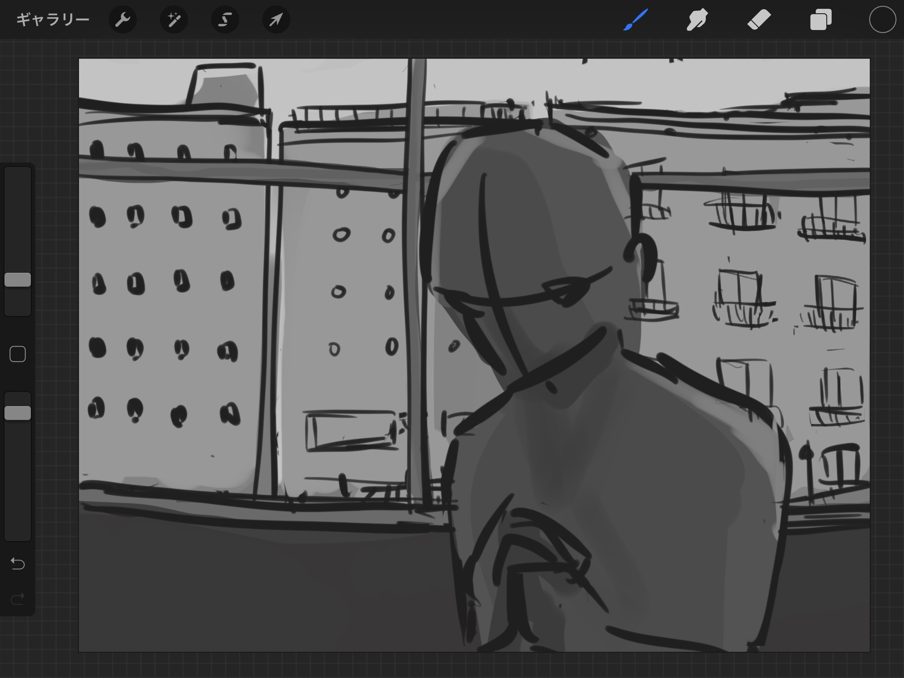
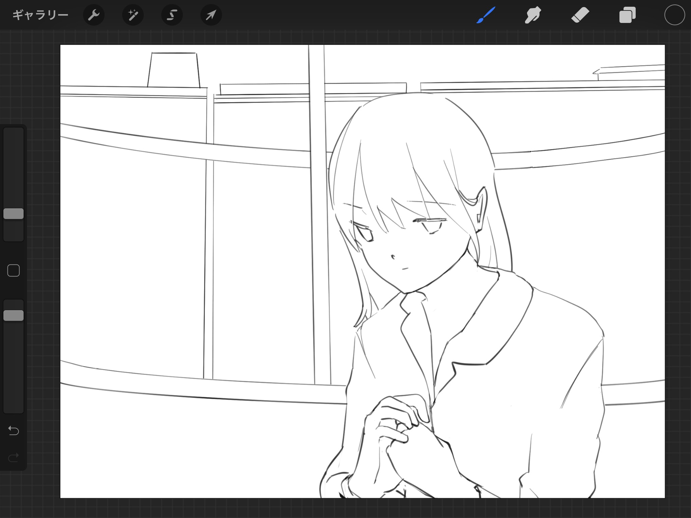

最近はいつも、何か描きたいものができた時にはグレースケールでまず考えるようにしている。ちなみにグレースケールのいいところは自分の頭の中のイメージをとりあえずざざっと描き留めておくことができることだと思う。

[[imageMedium]]
| 

こんな風に、ざざっとしたイメージを頭の中だけじゃなくて物理的に描いて保存しておく。

最近一つの絵を描き始めてから描き終わるまでの作業を一日で済ませることができないから、こんな風に描き留めておくともう一度絵を描こうとしたときに、描き始めた時の目標みたいなものを案外簡単に思い出せたりもする。

あと、グレースケールで最初のイメージを描いておくとコントラストのバランスが客観的に認識しやすいから、やっぱりイメージに沿った絵を描きたいのならグレースケールで最初のざっとした雰囲気を決めておくのが大事だと思う。

[[imageMedium]]
| 

そして今日はここまで。

グレースケールまでは決めたものの、やっぱりちゃんと色を塗るとなるとディテールを付け足さなくちゃいけないから、難しいんだよなぁ・・・。と改めて実感する今日この頃。