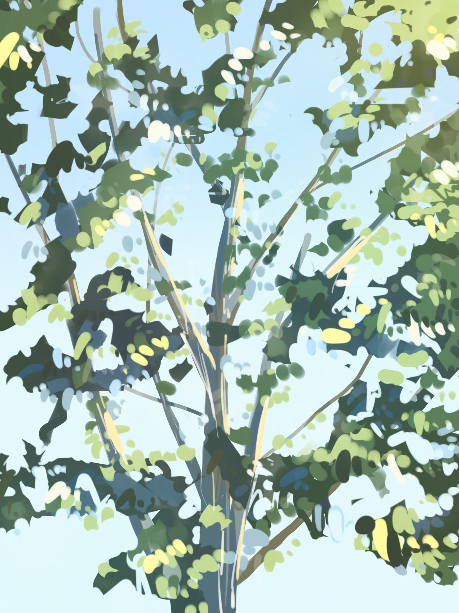
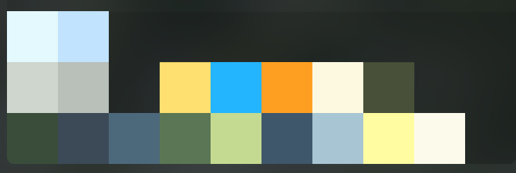

ここでは何気なく描いた絵や絵の途中経過なんかをあげていきたい。

[[imageMedium]]
| 

この絵は何気なく描いた絵。もう少しねっとりとした木が描きたかったけど、結構あっさりとしてしまった。やっぱり思っている通りにはならないものですね。というかそもそも葉っぱの形が適当すぎる・・・。

一応記録用だから、使った配色でも載せておこう。

####使った色

[[imageMedium]]
| 

木自体は、比較的彩度は低め（パレットの下の色）。最後にフィルターで明るい色を被せて（パレットの真ん中のオレンジとか青とか）どうにかイメージに近づけようと頑張った気がする。

でもほんとは、絵を描き始める前にどの部分にフィルターを被せるかイメージしながら描くのがいいんだろうな。

反省してたらまた描きたくなってくる。
